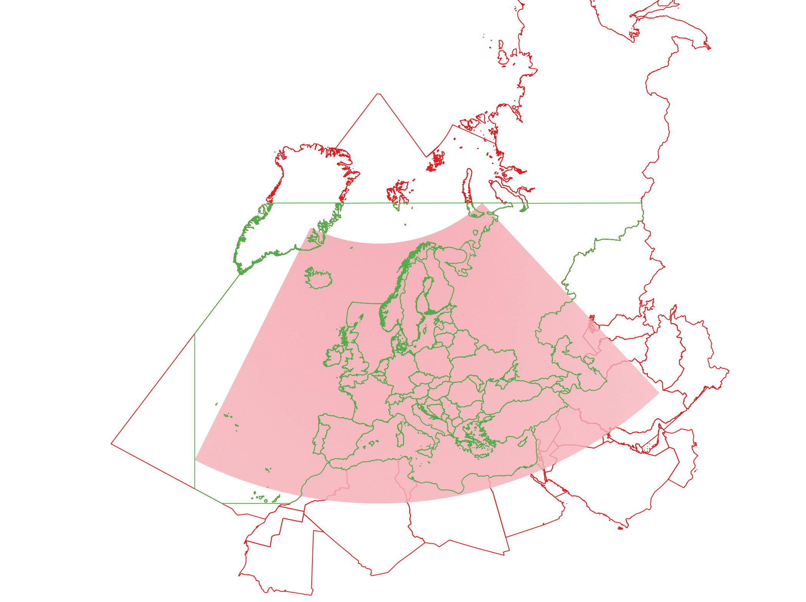
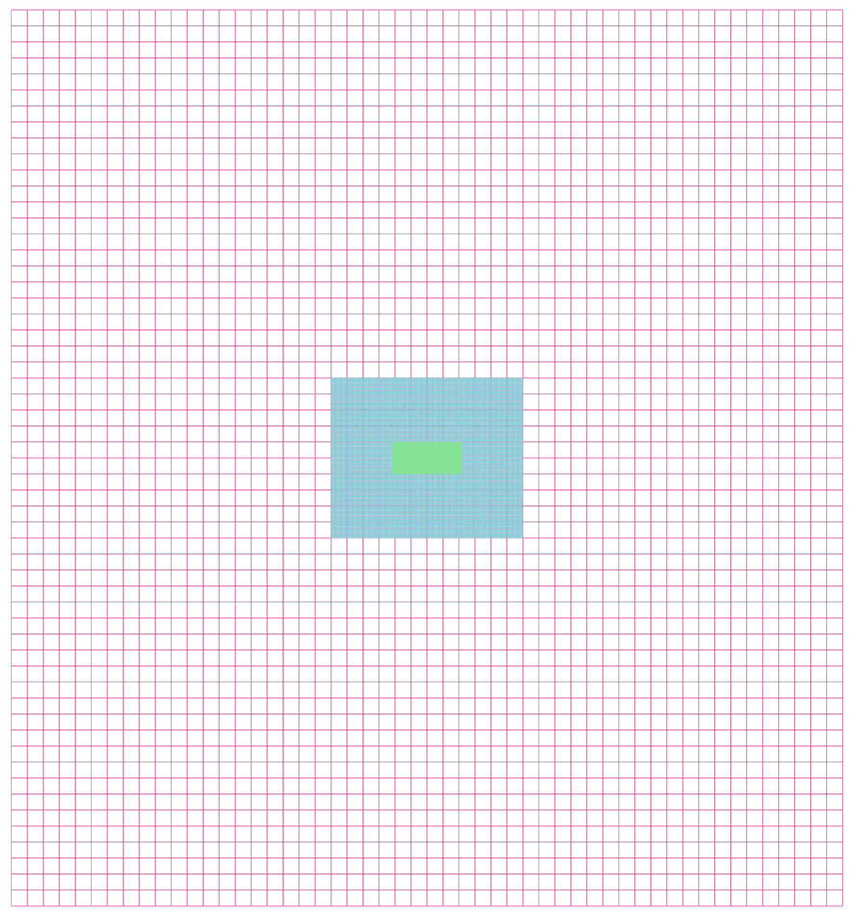
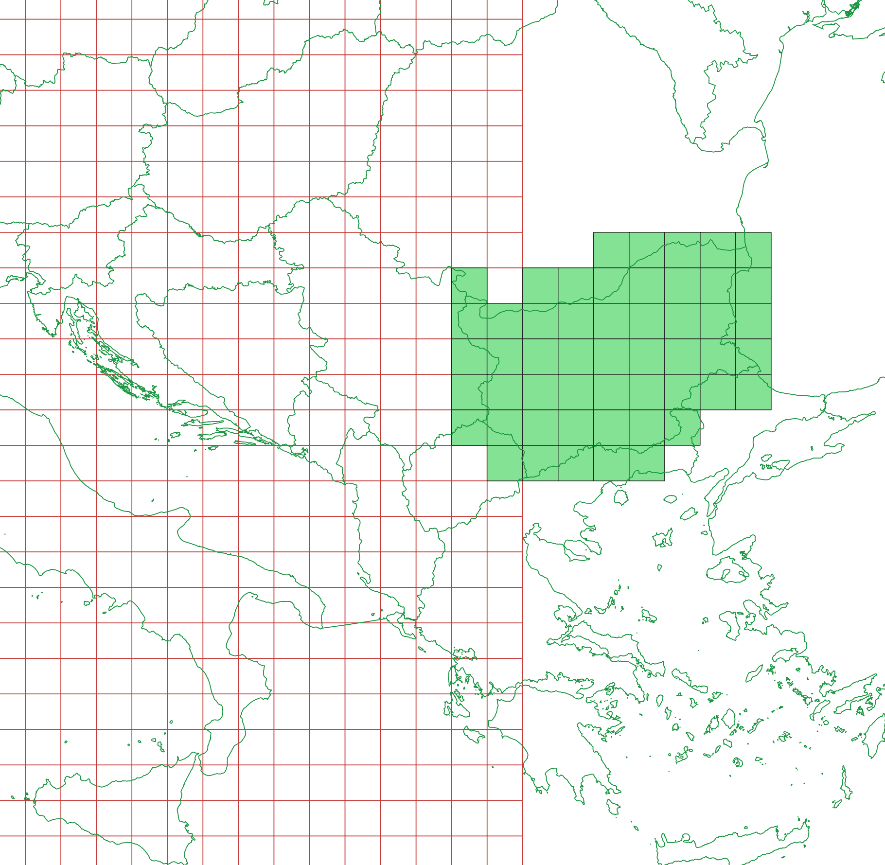
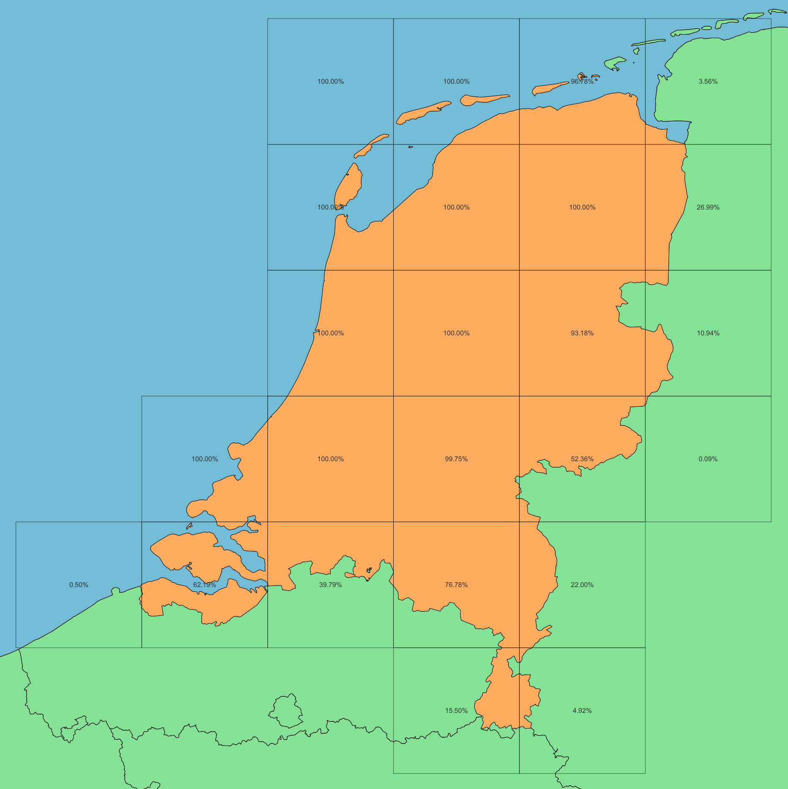

# E-MAP model implementation
## Steps

# Parse the configuration file
The provided configuaration file is read to obtain the configuration details of the model run

# Create the spatial pattern inventory
The spatial directory is scanned for available patterns for the configured year
If a spatial pattern exceptions file is configured, the file is parsed. This allows overriding the spatial pattern for some cases if needed.

# Create the emission inventory
Based on the configured year and reporting year the emission inventory is created using the various input files for NFR/GNFR emissions containing diffuse or point emissions.

- If gnfr data is available for the requested reporting year, the NFR sectors will be rescaled so the sum matches the reported gnfr values.
- If no gnfr data is available the GNFR emissions from the previous year will be used and the emissions will be extrapolated.

# Spread the emissions
The emissions from the emission inventory will now be spread using the spatial patterns from the spatial pattern inventory.

- The countries vector file is projected to the output grid and clipped to the extent of the CAMS grid. This is done to avoid processing of cells that are far outside of the model grid for large countries and oceans that intersect with the model grid. (this is done both for the regular and eez vector)

 Included boundaries  
 Clipped boundaries (outside of grid or country code not in configuration) 
 CAMS grid

- The model will then iterate over the grids defined in the current output grid, starting from the coursest resolution to the finest resolution. This way the model supports grids that contain subareas with a finer resolution. (e.g. Vlops60km)

 60km
 5km
 1km

    Each grid iteration consists of the following steps:
    - Divide the countries in cells for the current grid. For the coursest grid all the cells of the country are included even if they are not located in the output grid. They are included because the emissions are spread over the entire country and afterwards the cells outside of the output grid are clipped. 
    
     Output grid
     Country cells (Bulgaria)  
    For the country borders, the pecentage of the cell that is contained within the country is calculated.
    For land sectors the contained percentage is calculated taking into the account only the regions of type 'land'. So a cell that contains both land from a single region and sea will have a percentage of 100% for that region. 
    **Example: Cell coverages for Holland**
    
     Holland
     Other land regions
     Water regions 
    
    - The model will then spread the emissions for every Country/Sector/Pollutant combination. For each combination the spatial pattern is obtained from the spatial pattern inventory and this pattern. The spatial pattern is projected to the output grid, then the country is extracted from the spatial pattern using the calculated cell coverage percentages. This grid is then normalised and multiplied with the diffuse emissions from the emission inventory. If point sources are available they will be added to the resulting grid.
    - In the case of a multi resolution grid the emissions in the extent of the upcoming finer grid are summed and cut out of the current grid. The sums are stored and will be spread in the next iteration for the finer resolution sub grid.

> For land sectors the country borders from the `03_spatial_aggregation/boundaries.gpkg` vector are used, for sea sectors the country borders from the `03_spatial_aggregation/boundaries_inc_EEZ.gpkg` vector are used.

# Obtaining a spatial pattern
The following logic is applied to obtain a spatial pattern from the inventory for a Country/Sector/Pollutant combination:
- Check if the sector should be with a different sector pattern (congigured through the `via_NFR` or `via_GNFR` column in the spatial pattern exceptions file)
- Check if the sector has an explicit exception path configured in the exceptions file (file_path column in the spatial pattern exceptions file)
- If no exceptions are configured the regular patterns are checked from the emission inventory
    - Patterns from `03_spatial_aggregation/bef` for Flanders
    - Patterns from `03_spatial_aggregation/bef` for the other countries
- If no spatial pattern has been found yet, check if there is a fallback pollutant configured for the current pollutant in `03_spatial_aggregation/pollutant_reference_when_missing` if this is the case then same search logic is applied again but now with the fallback pollutant
- If no spatial pattern could be found the emissions a spatial pattern is created for the country with a uniform spread pattern

> Before a spatial pattern is considered as found, the current country is first extracted from the spatial pattern. If the sum of the extracted cells is 0 then the spatial pattern is not considered as found and the search logic continues.
